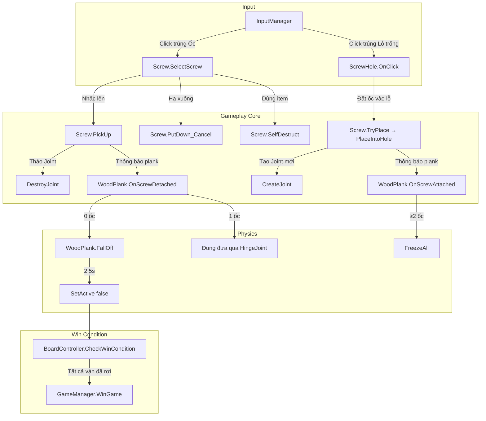
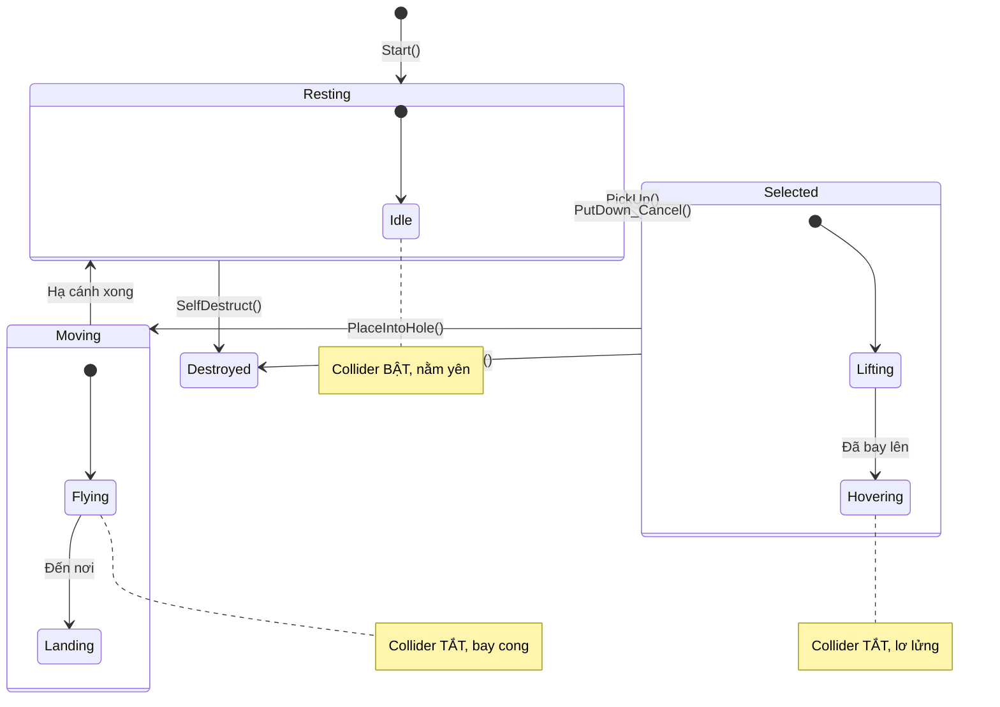
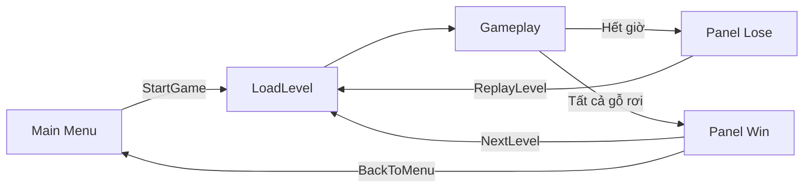

# 🔩 Giải Thích Đầy Đủ Cơ Chế Gameplay — Wood Screw Puzzle

## Tổng Quan Kiến Trúc

Game là một **puzzle 2D** trong Unity, nơi người chơi phải **tháo tất cả ốc vít** ra khỏi các tấm ván gỗ xếp chồng lên nhau. Khi một tấm ván không còn ốc nào giữ, nó sẽ rơi xuống và biến mất. Mục tiêu: **loại bỏ tất cả ván gỗ**.



---

## 1. InputManager — Bộ Não Xử Lý Click

📁 [InputManager.cs](file:///c:/Users/FSOS/Music/DuAnGame/Assets/Scripts/Core/InputManager.cs)

> [!IMPORTANT]
> Đây là **trung tâm điều khiển duy nhất** cho mọi tương tác click/tap. Tất cả logic click đều đi qua đây, **KHÔNG** dùng `OnMouseDown()` trên từng object.

### Luồng xử lý chi tiết:

```csharp
private void Update()
{
    if (Input.GetMouseButtonDown(0))  // Click chuột trái HOẶC Tap trên điện thoại
    {
        HandleInput();
    }
}
```

### `HandleInput()` — 4 bước xử lý:

**Bước 1: Lọc UI Click**
```csharp
if (EventSystem.current != null && EventSystem.current.IsPointerOverGameObject()) return;
```
- Nếu người chơi click vào nút UI (Pause, Settings...) thì **bỏ qua** hoàn toàn
- Tránh tình trạng click nút Pause mà lại chọn ốc bên dưới

**Bước 2: Raycast xuyên thấu**
```csharp
Vector2 mousePos = _cam.ScreenToWorldPoint(Input.mousePosition);
Collider2D[] allHits = Physics2D.OverlapPointAll(mousePos);
```
- Dùng `OverlapPointAll` thay vì `Raycast` thông thường → **bắt được TẤT CẢ** object tại điểm click, kể cả đang bị che khuất
- Lý do: Ốc có thể nằm dưới nhiều lớp gỗ, nhưng vẫn cần click được

**Bước 3: Ưu tiên tìm Ốc trước**
```csharp
foreach (var hitObj in allHits)
{
    Screw screw = hitObj.GetComponent<Screw>();
    if (screw == null) screw = hitObj.GetComponentInParent<Screw>();
    if (screw != null)
    {
        screw.SelectScrew();  // → Gọi logic chọn/hủy chọn ốc
        return;               // Chỉ xử lý 1 ốc, rồi dừng
    }
}
```
- **Ốc luôn được ưu tiên** hơn Lỗ → Click vào vị trí có cả Ốc lẫn Lỗ → chọn Ốc

**Bước 4: Tìm Lỗ + Kiểm tra tầm nhìn (Visibility Check)**

Đây là phần phức tạp nhất. Khi tìm được lỗ, hệ thống phải kiểm tra xem có tấm gỗ nào **nằm phía trên** đang **che khuất** lỗ đó không:

```csharp
// Tìm Lỗ có Sorting Order CAO NHẤT (lớp trên cùng)
ScrewHole bestHole = null;
int maxOrder = -999;
// ... duyệt tìm lỗ có order cao nhất
```

Sau đó kiểm tra blocking:

```
Gỗ nằm TRÊN lỗ (Sorting Order cao hơn)
    ├── Gỗ có ScrewHole tại điểm click? → ✅ Cho xuyên qua (lỗ trên gỗ = vùng trống)
    ├── Gỗ có HoleMask (SpriteMask) tại điểm click? → ✅ Cho xuyên qua (lỗ visual)
    └── Gỗ đặc (không có lỗ nào)? → ❌ CHẶN! Không cho đặt ốc
```

> [!NOTE]
> **HoleMask** là `SpriteMask` nằm trên thanh gỗ, tạo hiệu ứng "đục lỗ" visual. Hệ thống kiểm tra bounds của mask để xác định vùng "trong suốt" trên gỗ.

---

## 2. Screw (Ốc Vít) — Thực Thể Chính Của Gameplay

📁 [Screw.cs](file:///c:/Users/FSOS/Music/DuAnGame/Assets/Scripts/Gameplay/Screw.cs)

### 2.1 Khởi tạo và Auto-Detect

```csharp
private void Awake()
{
    _sr = GetComponent<SpriteRenderer>();
    if (_sr.sprite == null) _sr.sprite = MakeScrewSprite();  // Tự vẽ sprite nếu chưa có

    Rigidbody2D rb = GetComponent<Rigidbody2D>();
    if (rb != null) rb.isKinematic = true;  // ỐC LUÔN LÀ KINEMATIC
}
```

> [!IMPORTANT]
> Ốc được đặt là `isKinematic = true` **VĨNH VIỄN**. Nghĩa là ốc **không bị ảnh hưởng bởi lực vật lý** — nó chỉ di chuyển bằng code (coroutine), không bao giờ bị gỗ đẩy hay trọng lực kéo.

**Auto-detect trong `Start()`:**
```csharp
Collider2D[] hits = Physics2D.OverlapCircleAll(transform.position, 0.2f);
```
- Quét vùng tròn nhỏ (bán kính 0.2) quanh vị trí ốc
- Tự động tìm `WoodPlank` nào đang nằm ở đây → thêm vào `pinningPlanks` (danh sách ván gỗ bị ghim)
- Tự động tìm `ScrewHole` nào ở đây → gán `currentHole`
- Gọi `plank.OnScrewAttached(this)` để thông báo cho ván gỗ biết "tôi đang ghim bạn"
- Gọi `CreateJoint()` để tạo liên kết vật lý

### 2.2 Hệ thống Joint — Chốt Khóa Vật Lý

```csharp
private void CreateJoint()
{
    foreach (WoodPlank plank in pinningPlanks)
    {
        HingeJoint2D joint = plank.gameObject.AddComponent<HingeJoint2D>();
        joint.connectedBody = GetComponent<Rigidbody2D>();  // Nối gỗ VÀO ốc
        joint.anchor = plank.transform.InverseTransformPoint(transform.position);
        joint.connectedAnchor = Vector2.zero;
        joint.enableCollision = false;  // Tắt va chạm giữa gỗ-ốc trong joint
    }
}
```

**Giải thích cơ chế:**
- `HingeJoint2D` = bản lề — cho phép gỗ **xoay quanh ốc** như một trục
- `anchor` = điểm neo trên thân thanh gỗ (chuyển đổi vị trí ốc sang tọa độ local của gỗ)
- `connectedAnchor = Vector2.zero` = tâm ốc
- Khi chỉ còn **1 ốc**: gỗ sẽ **đung đưa/xoay** quanh ốc đó nhờ joint này + trọng lực
- Khi có **≥2 ốc**: gỗ bị FreezeAll nên joint không có tác dụng xoay (gỗ đứng im)

### 2.3 State Machine — Máy Trạng Thái Của Ốc



### 2.4 `SelectScrew()` — Điểm vào chính

```csharp
public void SelectScrew()
{
    if (isMoving) return;  // Đang bay → không cho click

    // TRƯỜNG HỢP ĐẶC BIỆT: Dùng vật phẩm phá ốc
    if (UseItem.isDestroyingScrew)
    {
        if (Inventory.Instance.UseUnscrew())
        {
            SelfDestruct();
            UseItem.isDestroyingScrew = false;
            return;
        }
    }

    if (!isSelected) PickUp();       // Chưa chọn → Nhấc lên
    else PutDown_Cancel();           // Đang chọn → Hạ xuống (hủy)
}
```

### 2.5 `PickUp()` — Nhấc Ốc Lên

Đây là hàm phức tạp nhất, xử lý **4 bước** theo thứ tự nghiêm ngặt:

**BƯỚC 1: Tìm thanh gỗ đang "tựa" vào ốc**
```csharp
_frozenLeaningPlanks.Clear();
Collider2D[] nearbyHits = Physics2D.OverlapCircleAll(transform.position, 0.5f);
```
- Quét vùng rộng hơn (0.5) để tìm **gỗ đang tựa** — khác với `pinningPlanks` (gỗ bị ốc ghim trực tiếp)
- "Tựa" = gỗ đang nằm lên trên ốc nhưng không bị ốc ghim

**BƯỚC 2: Đóng băng gỗ đang tựa TRƯỚC KHI tắt collider**
```csharp
foreach (WoodPlank plank in _frozenLeaningPlanks)
{
    Rigidbody2D rb = plank.GetComponent<Rigidbody2D>();
    rb.velocity = Vector2.zero;
    rb.angularVelocity = 0f;
    rb.constraints = RigidbodyConstraints2D.FreezeAll;
}
```

> [!WARNING]
> **Thứ tự rất quan trọng!** Nếu tắt collider ốc trước rồi mới freeze gỗ → trong 1 frame ngắn, gỗ mất điểm tựa và rớt. Freeze trước → gỗ đứng im → tắt collider an toàn.

**BƯỚC 3: Xử lý gỗ đang bị ghim (`pinningPlanks`)**
```csharp
foreach (WoodPlank plank in pinningPlanks)
{
    Collider2D pCol = plank.GetComponentInChildren<Collider2D>();
    if (pCol != null && col != null) Physics2D.IgnoreCollision(col, pCol, true);
    
    Rigidbody2D rb = plank.GetComponent<Rigidbody2D>();
    rb.isKinematic = true;
    rb.constraints = RigidbodyConstraints2D.FreezeAll;
}
DestroyJoint();  // Phá hủy tất cả HingeJoint2D
```
- `IgnoreCollision(col, pCol, true)` = ốc và gỗ **bỏ qua va chạm** với nhau
- Gỗ bị đặt `isKinematic + FreezeAll` → đứng im hoàn toàn, không rớt
- Phá hủy joint → gỗ không còn bị ràng buộc vật lý

**BƯỚC 4: Tắt collider ốc + bay lên**
```csharp
if (col != null) col.enabled = false;  // ỐC TÀNG HÌNH VẬT LÝ
StartCoroutine(LiftAnim());
```

### 2.6 `LiftAnim()` — Animation Bay Lên + Lơ Lửng

```csharp
private IEnumerator LiftAnim()
{
    Vector3 start = transform.position;
    Vector3 end = _restPos + Vector3.up * liftHeight;  // Bay lên 0.8 đơn vị
    float t = 0f;
    while (t < 1f)
    {
        t += Time.deltaTime / 0.12f;  // 0.12s để bay lên
        transform.position = Vector3.Lerp(start, end, Mathf.SmoothStep(0, 1, t));
        yield return null;
    }

    // Lơ lửng — dao động sin nhẹ lên xuống
    while (isSelected)
    {
        transform.position = end + Vector3.up * Mathf.Sin(Time.time * 4f) * 0.05f;
        yield return null;
    }
}
```
- Pha 1: Bay lên mượt mà trong 0.12s dùng `SmoothStep` (ease in-out)
- Pha 2: Lơ lửng vô hạn với hiệu ứng sin wave (biên độ 0.05, tần số 4Hz)
- Kết thúc khi `isSelected = false` (người chơi click nơi khác)

### 2.7 `PutDown_Cancel()` — Hạ Ốc Xuống (Hủy Bỏ)

```csharp
public void PutDown_Cancel()
{
    isSelected = false;
    _held = null;
    _sr.color = Color.white;     // Trả lại màu gốc (từ vàng → trắng)
    _sr.sortingOrder = 5;        // Trả lại lớp hiển thị bình thường

    if (currentHole != null) currentHole.SetScrew(this);  // Đăng ký lại lỗ

    StartCoroutine(ReturnAnimAndReconnect());
}
```

### 2.8 `ReturnAnimAndReconnect()` — Bay Về + Kết Nối Lại

```csharp
private IEnumerator ReturnAnimAndReconnect()
{
    isMoving = true;
    col.enabled = false;  // GIỮ TẮT collider trong lúc bay về

    // Bay về vị trí gốc
    Vector3 start = transform.position;
    float t = 0f;
    while (t < 1f)
    {
        t += Time.deltaTime / moveDuration;  // 0.25s
        transform.position = Vector3.Lerp(start, _restPos, Mathf.SmoothStep(0, 1, t));
        yield return null;
    }

    // Khôi phục IgnoreCollision → cho va chạm lại
    foreach (var plank in pinningPlanks)
        Physics2D.IgnoreCollision(col, pCol, false);

    // Tạo Joint TRƯỚC khi bật collider
    CreateJoint();

    // Đợi 1 FixedUpdate rồi MỚI bật collider
    yield return new WaitForFixedUpdate();
    col.isTrigger = false;
    col.enabled = true;

    UnfreezeLeaningPlanks();  // Rã đông gỗ đang tựa
    isMoving = false;
}
```

> [!TIP]
> **Tại sao tạo Joint TRƯỚC rồi mới bật collider?** Vì `HingeJoint2D` với `enableCollision = false` sẽ tự động bỏ qua va chạm giữa 2 body nối nhau. Nếu bật collider trước → 1 frame va chạm giữa ốc-gỗ gây giật.

### 2.9 `PlaceIntoHole()` — Đặt Ốc Vào Lỗ Mới

```csharp
private IEnumerator PlaceAnim(ScrewHole target)
{
    isMoving = true;
    isSelected = false;
    col.enabled = false;  // Tắt collider suốt quá trình bay

    // Lưu lại gỗ cũ nhưng CHƯA tháo (giữ freeze)
    List<WoodPlank> oldPlanks = new List<WoodPlank>(pinningPlanks);
    pinningPlanks.Clear();

    // GIAI ĐOẠN 1: Bay theo đường cong Bézier bậc 2
    Vector3 sp = transform.position;  // Điểm bắt đầu
    Vector3 ep = target.transform.position;  // Điểm đích
    Vector3 mp = (sp + ep) * 0.5f + Vector3.up * 0.5f;  // Điểm kiểm soát (phía trên)
    
    while (elapsed < moveDuration)
    {
        float t = elapsed / moveDuration;
        float u = 1f - t;
        transform.position = u*u*sp + 2*u*t*mp + t*t*ep;  // Công thức Bézier
        transform.Rotate(0, 0, -500f * Time.deltaTime);    // Xoay vòng khi bay
        yield return null;
    }
```

**Công thức Bézier bậc 2:** `B(t) = (1-t)²·P₀ + 2(1-t)t·P₁ + t²·P₂`
- `P₀` = vị trí ốc hiện tại
- `P₁` = điểm giữa, **nhấc lên 0.5 đơn vị** → tạo đường cong
- `P₂` = vị trí lỗ đích
- Ốc xoay 500°/s trong lúc bay → hiệu ứng visual đẹp mắt

```csharp
    // GIAI ĐOẠN 2: Tháo gỗ cũ (sau khi đã hạ cánh an toàn)
    foreach (var p in oldPlanks)
    {
        Physics2D.IgnoreCollision(col, pCol, false);  // Cho va chạm lại
        prb.isKinematic = false;  // Trả lại vật lý
        p.OnScrewDetached(this);  // Thông báo tháo ốc
    }

    // GIAI ĐOẠN 3: Gắn vào gỗ mới
    Collider2D[] hits = Physics2D.OverlapCircleAll(ep, 0.2f);  // Quét tìm gỗ ở lỗ mới
    foreach (var hit in hits)
    {
        WoodPlank plank = hit.GetComponentInParent<WoodPlank>();
        if (plank != null) pinningPlanks.Add(plank);
    }
    
    foreach (var p in pinningPlanks)
        p.OnScrewAttached(this);
    
    CreateJoint();
    yield return new WaitForFixedUpdate();
    col.enabled = true;  // Bật lại collider
    UnfreezeLeaningPlanks();
```

> [!IMPORTANT]
> **Tại sao tháo gỗ cũ SAU KHI hạ cánh?** Nếu tháo ngay → gỗ cũ có thể rớt ngay lập tức, gây hiệu ứng giật. Chờ bay xong → tháo → gỗ rớt tự nhiên.

### 2.10 `SelfDestruct()` — Phá Hủy Ốc Bằng Vật Phẩm

```csharp
public void SelfDestruct()
{
    if (currentHole != null) currentHole.SetScrew(null);  // Giải phóng lỗ
    DestroyJoint();                                        // Phá tất cả joint
    
    foreach (WoodPlank plank in pinningPlanks)
    {
        prb.isKinematic = false;       // Trả lại vật lý cho gỗ
        plank.OnScrewDetached(this);   // Thông báo tháo
    }
    
    if (_held == this) _held = null;
    AudioManager.Instance.PlaySound("Screw");
    Destroy(gameObject);               // Xóa ốc khỏi game
}
```

### 2.11 `UnfreezeLeaningPlanks()` — Rã Đông Gỗ Tựa

```csharp
private void UnfreezeLeaningPlanks()
{
    foreach (var plank in _frozenLeaningPlanks)
    {
        int screwCount = plank._activeScrews.Count;
        
        if (screwCount >= 2)      // ≥2 ốc → Khóa cứng hoàn toàn
        {
            rb.gravityScale = 0f;
            rb.constraints = RigidbodyConstraints2D.FreezeAll;
        }
        else if (screwCount == 1) // 1 ốc → Cho đung đưa
        {
            rb.isKinematic = false;
            rb.constraints = RigidbodyConstraints2D.None;
            rb.gravityScale = 1.0f;
        }
        else                      // 0 ốc → Rơi tự do (trọng lực tăng cường)
        {
            rb.isKinematic = false;
            rb.constraints = RigidbodyConstraints2D.None;
            rb.gravityScale = 2.5f;  // Rơi nhanh hơn bình thường
        }
    }
}
```

### 2.12 Biến Static `_held` — Quản Lý "Tay Cầm"

```csharp
private static Screw _held;  // Chỉ 1 ốc được cầm tại 1 thời điểm

public static bool HasHeld => _held != null;
public static void ClearHeld() { if (_held != null) _held.PutDown_Cancel(); }

public static void TryPlace(ScrewHole target)
{
    if (_held == null) return;
    if (!target.isEmpty) return;
    _held.PlaceIntoHole(target);
}
```

> [!NOTE]
> `_held` là **static** → chỉ có **DUY NHẤT 1 ốc** được cầm trên toàn bộ game tại bất kỳ thời điểm nào. Nếu click ốc khác khi đang cầm 1 ốc → ốc cũ tự động hạ xuống (`PutDown_Cancel`).

---

## 3. WoodPlank (Tấm Ván Gỗ)

📁 [WoodPlank.cs](file:///c:/Users/FSOS/Music/DuAnGame/Assets/Scripts/Gameplay/WoodPlank.cs)

### 3.1 Khởi tạo vật lý

```csharp
private void Awake()
{
    _rb = GetComponent<Rigidbody2D>();
    
    // BAN ĐẦU: Gỗ bị khóa cứng hoàn toàn
    _rb.gravityScale = 0f;
    _rb.isKinematic = false;           // Dynamic (tham gia vật lý)
    _rb.constraints = RigidbodyConstraints2D.FreezeAll;  // Nhưng đóng băng tất cả
    _rb.interpolation = RigidbodyInterpolation2D.Interpolate;  // Mượt mà
    _rb.mass = 1.0f;
    _rb.drag = 0.5f;           // Ma sát tuyến tính → giảm trượt
    _rb.angularDrag = 0.8f;    // Ma sát xoay → giảm lắc
}
```

> [!NOTE]
> Gỗ ban đầu là `Dynamic` (không phải Kinematic) nhưng bị `FreezeAll` → nó **có thể tham gia va chạm** với các vật thể khác nhưng **không tự di chuyển**. Chỉ khi tháo ốc, constraints mới được gỡ.

### 3.2 Hệ Thống Layer — Va Chạm Chọn Lọc

```csharp
public int layerID = 0;  // Mỗi thanh gỗ có 1 Layer ID

private void Start()
{
    Collider2D myCol = GetComponentInChildren<Collider2D>();
    WoodPlank[] allPlanks = FindObjectsOfType<WoodPlank>();
    
    foreach (var other in allPlanks)
    {
        if (other.layerID != this.layerID)
        {
            // KHÁC TẦNG → XUYÊN QUA NHAU
            Physics2D.IgnoreCollision(myCol, otherCol);
        }
    }
}
```

**Giải thích:**
```
Tầng 1 (layerID = 1):  [Gỗ A] [Gỗ B]  → Va chạm với nhau ✅
Tầng 2 (layerID = 2):  [Gỗ C] [Gỗ D]  → Va chạm với nhau ✅
Gỗ A vs Gỗ C:  → Xuyên qua ❌ (khác tầng)
```

- Cho phép thiết kế puzzle phức tạp với nhiều lớp gỗ xếp chồng
- Gỗ cùng tầng va chạm → đẩy nhau → cản trở việc rơi
- Gỗ khác tầng xuyên qua → không ảnh hưởng lẫn nhau

### 3.3 `EnsurePlankHole()` — Tự Tạo Lỗ Trên Gỗ

```csharp
private void EnsurePlankHole(Screw screw)
{
    // Kiểm tra xem đã có lỗ ở vị trí này chưa
    Collider2D[] hits = Physics2D.OverlapCircleAll(screw.transform.position, 0.15f);
    foreach (var h in hits)
        if (h.GetComponent<ScrewHole>() != null && h.transform.IsChildOf(transform)) return;

    // TẠO LỖ MỚI bằng code (không dùng Prefab)
    GameObject hObj = new GameObject($"PlankHole_{screw.name}");
    hObj.transform.SetParent(transform);  // Lỗ là con của thanh gỗ
    hObj.transform.position = screw.transform.position;

    SpriteRenderer hSr = hObj.AddComponent<SpriteRenderer>();
    hSr.sprite = ScrewHole.MakeHoleSprite();
    hSr.color = new Color(0, 0, 0, 0);  // Ẩn khi có ốc

    ScrewHole sh = hObj.AddComponent<ScrewHole>();
    sh.holeType = ScrewHole.HoleType.PlankHole;
    sh.ownerPlank = this;
    sh.SetScrew(screw);

    CircleCollider2D col = hObj.AddComponent<CircleCollider2D>();
    col.radius = 0.28f;
    col.isTrigger = true;  // Collider là Trigger (không va chạm vật lý)
}
```

> [!TIP]
> Lỗ trên gỗ (`PlankHole`) di chuyển THEO gỗ vì là child object. Khi gỗ đung đưa/rơi, lỗ cũng đi theo → ốc có thể được đặt vào lỗ đang di chuyển.

### 3.4 `OnScrewDetached()` — Khi Bị Tháo Ốc

```csharp
public void OnScrewDetached(Screw screw)
{
    _activeScrews.Remove(screw);

    // Tìm lỗ tương ứng → đặt trạng thái "trống"
    foreach (var hole in GetComponentsInChildren<ScrewHole>())
    {
        if (Vector2.Distance(hole.transform.position, screw.transform.position) < 0.1f)
            hole.SetScrew(null);
    }

    if (_activeScrews.Count <= 0)
    {
        // 0 ốc → RƠI TỰ DO
        _fallCoroutine = StartCoroutine(FallOff());
    }
    else if (_activeScrews.Count == 1)
    {
        // 1 ốc → ĐUNG ĐƯA (HingeJoint điều khiển)
        _rb.constraints = RigidbodyConstraints2D.None;
        _rb.gravityScale = 1.0f;
        _rb.WakeUp();
    }
}
```

### 3.5 `OnScrewAttached()` — Khi Được Gắn Ốc

```csharp
public void OnScrewAttached(Screw screw)
{
    if (!_activeScrews.Contains(screw))
        _activeScrews.Add(screw);

    // Tìm lỗ → đánh dấu "đã có ốc"
    foreach (var hole in GetComponentsInChildren<ScrewHole>())
    {
        if (Vector2.Distance(hole.transform.position, screw.transform.position) < 0.1f)
            hole.SetScrew(screw);
    }

    // Nếu đang rơi → HỦY NGAY
    if (_fallCoroutine != null)
    {
        StopCoroutine(_fallCoroutine);
        _fallCoroutine = null;
        _isFreed = false;
    }

    if (_activeScrews.Count >= 2)
    {
        // ≥2 ốc → KHÓA CỨNG
        _rb.gravityScale = 0f;
        _rb.constraints = RigidbodyConstraints2D.FreezeAll;
    }
    else if (_activeScrews.Count == 1)
    {
        // 1 ốc → ĐUNG ĐƯA
        _rb.gravityScale = 1.0f;
        _rb.constraints = RigidbodyConstraints2D.None;
    }
}
```

### 3.6 `FallOff()` — Cơ Chế Rơi + Kiểm Tra Thắng

```csharp
private IEnumerator FallOff()
{
    _isFreed = true;
    _rb.constraints = RigidbodyConstraints2D.None;
    _rb.gravityScale = 2.5f;  // Rơi nhanh gấp 2.5 lần

    yield return new WaitForSeconds(2.5f);  // Đợi 2.5s

    gameObject.SetActive(false);  // Biến mất (không Destroy → tiết kiệm)
    
    BoardController.Instance.CheckWinCondition();  // Kiểm tra thắng!
}
```

**Bảng trạng thái vật lý của thanh gỗ:**

| Số ốc | `isKinematic` | `constraints` | `gravityScale` | Hành vi |
|-------|---------------|---------------|----------------|---------|
| ≥ 2   | `false`       | `FreezeAll`   | `0`            | Đứng im hoàn toàn |
| = 1   | `false`       | `None`        | `1.0`          | Đung đưa quanh ốc (HingeJoint) |
| = 0   | `false`       | `None`        | `2.5`          | Rơi tự do nhanh, 2.5s sau biến mất |

---

## 4. ScrewHole (Lỗ Ốc)

📁 [ScrewHole.cs](file:///c:/Users/FSOS/Music/DuAnGame/Assets/Scripts/Gameplay/ScrewHole.cs)

### 4.1 Hai Loại Lỗ

```csharp
public enum HoleType { BoardHole, PlankHole }
```

| Loại | Mô tả | Tạo bởi |
|------|--------|---------|
| `BoardHole` | Lỗ cố định trên bảng nền | Level Designer (đặt sẵn trong Prefab) |
| `PlankHole` | Lỗ di động trên thanh gỗ | `WoodPlank.EnsurePlankHole()` (tự động code) |

### 4.2 `SetScrew()` — Cập Nhật Trạng Thái

```csharp
public void SetScrew(Screw screw)
{
    currentScrew = screw;
    isEmpty = (screw == null);
    RefreshVisual();

    // TẮT collider nếu có ốc → nhường click cho ốc
    Collider2D col = GetComponent<Collider2D>();
    if (col != null) col.enabled = isEmpty;
}
```

> [!IMPORTANT]
> Khi có ốc → collider của lỗ bị **TẮT**. Lý do: click vào vị trí đó phải trúng **ốc** (để chọn ốc), **không phải** trúng lỗ. Chỉ khi lỗ trống → collider bật → có thể đặt ốc mới.

### 4.3 `RefreshVisual()` — Hiệu Ứng Visual

```csharp
if (isEmpty) _sr.color = new Color(0.15f, 0.08f, 0.03f, 0.85f);  // Lỗ tối, hơi trong suốt
else _sr.color = new Color(0f, 0f, 0f, 0f);                       // HOÀN TOÀN ẨN
```

### 4.4 Tự Nhận Diện Chủ Nhân

```csharp
private void Start()
{
    if (holeType == HoleType.PlankHole && ownerPlank == null)
    {
        // Tìm thanh gỗ có Sorting Order CAO NHẤT tại vị trí này
        Collider2D[] allHits = Physics2D.OverlapPointAll(transform.position);
        WoodPlank bestPlank = null;
        int maxOrder = -999;
        
        foreach (var hitObj in allHits)
        {
            WoodPlank p = hitObj.GetComponentInParent<WoodPlank>();
            if (p != null)
            {
                SpriteRenderer sr = p.GetComponentInChildren<SpriteRenderer>();
                int order = (sr != null) ? sr.sortingOrder : 0;
                if (order > maxOrder)
                {
                    maxOrder = order;
                    bestPlank = p;
                }
            }
        }
        
        if (bestPlank != null) ownerPlank = bestPlank;
    }
}
```

---

## 5. BoardController — Trọng Tài Kiểm Tra Thắng/Thua

📁 [BoardController.cs](file:///c:/Users/FSOS/Music/DuAnGame/Assets/Scripts/Gameplay/BoardController.cs)

```csharp
public class BoardController : MonoBehaviour
{
    public static BoardController Instance { get; private set; }
    private List<WoodPlank> _planks;
    private bool _levelDone = false;
    public int prize;

    private void Start()
    {
        _planks = FindObjectsOfType<WoodPlank>().ToList();
        prize = _planks.Count * 10;  // Phần thưởng = số ván × 10
    }

    public void CheckWinCondition()
    {
        if (_levelDone) return;
        
        // THẮNG khi TẤT CẢ ván gỗ đã rơi/biến mất
        if (_planks.All(p => p == null || !p.gameObject.activeSelf || p.IsFreed))
        {
            _levelDone = true;
            StartCoroutine(TriggerWin());
        }
    }

    private IEnumerator TriggerWin()
    {
        yield return new WaitForSeconds(0.8f);  // Đợi 0.8s (cho animation rơi cuối)
        GameManager.Instance.WinGame();
    }
}
```

**Điều kiện thắng:** Mỗi `WoodPlank` phải thỏa 1 trong 3:
- `p == null` (bị Destroy)
- `!p.gameObject.activeSelf` (bị SetActive false sau FallOff)
- `p.IsFreed` (đang rơi, chưa biến mất nhưng đã tự do)

---

## 6. CountdownTimer — Đồng Hồ Đếm Ngược

📁 [CountdownTimer.cs](file:///c:/Users/FSOS/Music/DuAnGame/Assets/Scripts/Gameplay/CountdownTimer.cs)

```csharp
public class CountdownTimer : MonoBehaviour
{
    public static float timeRemaining = 0f;
    public static bool isRunning = true;

    void Update()
    {
        if (isRunning)
        {
            if (timeRemaining > 0)
            {
                timeRemaining -= Time.deltaTime;
                UpdateTimerDisplay(timeRemaining);
            }
            else
            {
                timeRemaining = 0;
                isRunning = false;
                GameManager.Instance.TimerEnded();  // HẾT GIỜ → THUA
            }
        }
    }

    void UpdateTimerDisplay(float time)
    {
        int minutes = Mathf.FloorToInt(time / 60);
        int seconds = Mathf.FloorToInt(time % 60);
        
        if (time <= 10)
            timerText.color = Color.red;     // ≤10s → đỏ cảnh báo
        else
            timerText.color = Color.white;   // Bình thường
        
        timerText.text = string.Format("{0:00}:{1:00}", minutes, seconds);
    }
}
```

---

## 7. GameManager — Quản Lý Vòng Đời Game

📁 [GameManager.cs](file:///c:/Users/FSOS/Music/DuAnGame/Assets/Scripts/Core/GameManager.cs)

### Luồng chính:



### `LoadLevel()` — Tải Level

```csharp
private void LoadLevel(int index)
{
    if (currentLevelObject != null) Destroy(currentLevelObject);  // Xóa level cũ
    
    currentLevelObject = Instantiate(levelPrefabs[index], levelContainer);
    // → Tạo bản sao Prefab level, đặt vào container
    
    VibrationManager.Instance.Vibrate();
    TimeLimit();
    Resume();  // Đảm bảo Time.timeScale = 1
}
```

> [!NOTE]
> Game **không dùng Scene** riêng cho mỗi level. Thay vào đó, mỗi level là 1 **Prefab** chứa sẵn tất cả gỗ, ốc, lỗ. `GameManager` chỉ Instantiate/Destroy Prefab tương ứng.

### `WinGame()` — Xử Lý Thắng

```csharp
public void WinGame()
{
    ShowUI(panelWin);
    VibrationManager.Instance.Vibrate();
    AudioManager.Instance.PlaySound("Winning");
    txtWinningPrize.text = BoardController.Instance.prize.ToString();
    
    // Chỉ thêm tiền & mở level nếu chơi lần đầu
    if (currentLevelIndex + 1 > PlayerData.Instance.TotalLevelsCompleted)
    {
        PlayerData.Instance.AddCoins(BoardController.Instance.prize);
        PlayerData.Instance.IncrementTotalCompleted();
    }
    
    // Mở khóa level tiếp theo
    if (PlayerData.Instance.UnlockedLevel < currentLevelIndex + 2)
        PlayerData.Instance.UnlockLevel(currentLevelIndex + 2);
}
```

---

## 8. UseItem — Hệ Thống Vật Phẩm

📁 [UseItem.cs](file:///c:/Users/FSOS/Music/DuAnGame/Assets/Scripts/Managers/UseItem.cs)

```csharp
public class UseItem : MonoBehaviour
{
    public static bool isDestroyingScrew = false;  // Cờ static toàn cục

    // Khi bật Toggle "Unscrew" trên UI
    private void OnUseUnscrew(bool value)
    {
        if (Inventory.Instance.unscrews <= 0) return;  // Không đủ item
        isDestroyingScrew = value;
    }

    // Nút "+60s"
    public void Use60s()
    {
        if (Inventory.Instance.UseTime60s())
        {
            CountdownTimer.timeRemaining += 60;
        }
    }
}
```

**Luồng sử dụng Unscrew:**
1. Người chơi bật Toggle "Unscrew" → `isDestroyingScrew = true`
2. Người chơi click ốc → `Screw.SelectScrew()` phát hiện `isDestroyingScrew`
3. Gọi `Inventory.Instance.UseUnscrew()` → trừ 1 item
4. Gọi `SelfDestruct()` → ốc biến mất, gỗ rơi
5. Reset `isDestroyingScrew = false`

---

## 9. Các Script Hỗ Trợ Visual

### 9.1 ScrewRenderer — Vẽ Ốc Bằng Code

📁 [ScrewRenderer.cs](file:///c:/Users/FSOS/Music/DuAnGame/Assets/Scripts/Gameplay/ScrewRenderer.cs)

Tạo sprite ốc 64×64px bằng thuật toán:
- **Vòng ngoài** (tối hơn): bán kính 0.45 × texSize
- **Vòng trong** (sáng + gradient): bán kính 0.35 × texSize
- **Khe chữ thập (+)**: rãnh tối ở giữa, rộng 0.08 × texSize

### 9.2 PlankTextureGenerator — Vẽ Gỗ Bằng Code

📁 [PlankTextureGenerator.cs](file:///c:/Users/FSOS/Music/DuAnGame/Assets/Scripts/Gameplay/PlankTextureGenerator.cs)

Tạo texture gỗ 256×64px:
- Dùng `PerlinNoise` để tạo vân gỗ tự nhiên
- Thêm 6 đường vân ngang theo sóng sin
- Bo góc bằng công thức khoảng cách góc

### 9.3 BoardBackground — Vẽ Bảng Nền

📁 [BoardBackground.cs](file:///c:/Users/FSOS/Music/DuAnGame/Assets/Scripts/Gameplay/BoardBackground.cs)

Tạo bảng nền 480×680px:
- Viền ngoài tối (22px)
- Nền trong sáng với vân gỗ Perlin noise
- Bo góc tròn (28px radius)

---

## 10. Tổng Kết Luồng Gameplay Hoàn Chỉnh

```
1. GameManager.LoadLevel() → Instantiate Level Prefab
2. BoardController.Start() → Tìm tất cả WoodPlank
3. Screw.Start() → Auto-detect pinningPlanks + ScrewHole + CreateJoint
4. WoodPlank.Start() → Thiết lập IgnoreCollision giữa các tầng khác nhau

--- GAMEPLAY LOOP ---

5. Người chơi TAP vào ốc
6. InputManager.HandleInput() → tìm Screw → gọi SelectScrew()
7. Screw.PickUp() → Freeze gỗ → Tắt collider → LiftAnim

8a. TAP vào lỗ trống:
    → InputManager kiểm tra blocking
    → ScrewHole.OnClick() → Screw.TryPlace() → PlaceIntoHole()
    → Tháo gỗ cũ → Gắn gỗ mới → CreateJoint

8b. TAP vào ốc đang cầm:
    → PutDown_Cancel() → ReturnAnimAndReconnect()

9. WoodPlank: 0 ốc → FallOff() → 2.5s → SetActive(false)
10. BoardController.CheckWinCondition() → Tất cả rơi → WinGame()
11. CountdownTimer: Hết giờ → TimerEnded() → Thua
```
