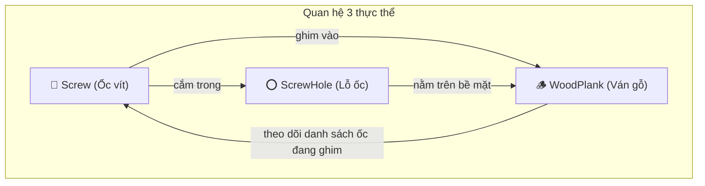
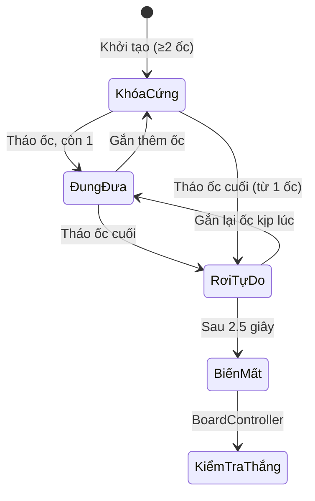
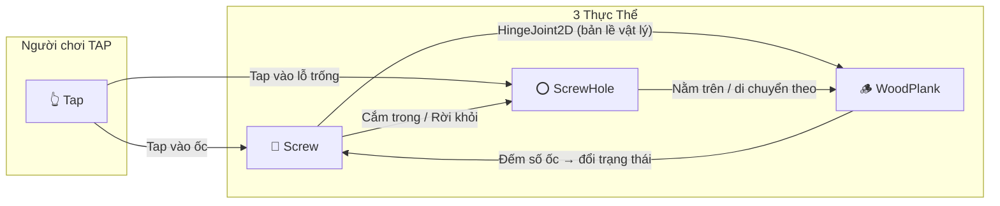

# 🔩 Tóm Tắt Cơ Chế Gameplay — 3 Thực Thể Chính

## Tổng Quan

Game là một **puzzle 2D** trong Unity. Người chơi phải tháo các **ốc vít (Screw)** ra khỏi các **tấm ván gỗ (WoodPlank)** bằng cách nhấc ốc lên rồi đặt vào các **lỗ trống (ScrewHole)** ở nơi khác. Khi một tấm ván không còn ốc nào giữ, nó sẽ rơi xuống và biến mất. Mục tiêu: **loại bỏ tất cả ván gỗ khỏi màn hình**.



---

## 1. 🔩 Screw — Ốc Vít

**File:** [Screw.cs](file:///c:/Users/FSOS/Music/DuAnGame/Assets/Scripts/Gameplay/Screw.cs)

### Vai trò
Ốc vít là **thực thể trung tâm** mà người chơi tương tác trực tiếp. Nó đóng vai trò **chốt khóa vật lý** — giữ các tấm ván gỗ cố định tại chỗ. Toàn bộ gameplay xoay quanh việc nhấc ốc ra và đặt ốc vào.

### Các trạng thái

| Trạng thái | Mô tả | Collider |
|------------|-------|----------|
| **Nghỉ (Resting)** | Nằm yên trong lỗ, đang ghim gỗ | Bật |
| **Được chọn (Selected)** | Đang lơ lửng trên không, chờ người chơi chọn lỗ đích | Tắt |
| **Đang di chuyển (Moving)** | Đang bay từ nơi này sang lỗ khác | Tắt |

### Cơ chế hoạt động

**a) Khởi tạo tự động (`Start`)**

Khi game bắt đầu, mỗi ốc tự quét vùng xung quanh bằng `Physics2D.OverlapCircleAll` để tìm:
- Những tấm ván gỗ nào đang nằm tại vị trí của nó → thêm vào danh sách `pinningPlanks`
- Lỗ ốc nào đang chứa nó → gán `currentHole`

Sau đó, ốc tạo **HingeJoint2D** (bản lề vật lý) nối từ mỗi tấm gỗ vào chính nó. Joint này cho phép gỗ **xoay quanh ốc** như một trục xoay khi chỉ còn 1 ốc giữ.

**b) Nhấc ốc lên (`PickUp`)**

Khi người chơi tap vào ốc, hệ thống thực hiện **4 bước theo thứ tự nghiêm ngặt**:

1. **Tìm gỗ đang tựa** — quét vùng rộng hơn để tìm những tấm gỗ đang nằm lên trên ốc (nhưng không bị ốc ghim trực tiếp)
2. **Đóng băng gỗ tựa** — đặt `FreezeAll` cho các tấm gỗ này để chúng không rớt khi ốc biến mất
3. **Xử lý gỗ bị ghim** — tắt va chạm giữa ốc-gỗ (`IgnoreCollision`), đóng băng gỗ, phá hủy tất cả HingeJoint
4. **Tắt collider ốc** rồi chạy animation bay lên

> Thứ tự này rất quan trọng: phải đóng băng gỗ **trước** khi tắt collider ốc, nếu không gỗ sẽ mất điểm tựa và rớt trong khoảnh khắc ngắn giữa 2 frame.

Ốc bay lên rồi lơ lửng với hiệu ứng dao động hình sin nhẹ, chờ người chơi chọn nơi đặt.

**c) Đặt ốc vào lỗ mới (`PlaceIntoHole`)**

Ốc bay theo **đường cong Bézier bậc 2** — tạo quỹ đạo vòng cung đẹp mắt thay vì đường thẳng. Công thức:

```
B(t) = (1-t)²·Pstart + 2(1-t)t·Pmid + t²·Pend
```

Trong đó `Pmid` là điểm giữa được nhấc lên cao, tạo đường cong. Ốc đồng thời **xoay tròn** khi bay.

Sau khi hạ cánh:
- Tháo liên kết với gỗ cũ → gỗ cũ có thể rơi
- Quét tìm gỗ mới tại lỗ đích → tạo HingeJoint mới
- Bật lại collider

**d) Phá hủy ốc (`SelfDestruct`)**

Khi người chơi dùng vật phẩm "Unscrew", ốc bị xóa ngay lập tức: giải phóng lỗ, phá joint, thông báo cho gỗ, rồi `Destroy(gameObject)`.

### Thiết kế đặc biệt

- Ốc luôn là **Kinematic** — không bao giờ bị trọng lực hay lực va chạm ảnh hưởng, chỉ di chuyển bằng code
- Biến `_held` là **static** — đảm bảo chỉ có **đúng 1 ốc** được cầm tại mọi thời điểm trong toàn bộ game. Nếu tap ốc khác khi đang cầm, ốc cũ tự động hạ xuống.
- Collider bị **tắt hoàn toàn** khi ốc đang bay → tránh tình trạng ốc đẩy gỗ khi di chuyển ngang qua

---

## 2. 🪵 WoodPlank — Tấm Ván Gỗ

**File:** [WoodPlank.cs](file:///c:/Users/FSOS/Music/DuAnGame/Assets/Scripts/Gameplay/WoodPlank.cs)

### Vai trò
Ván gỗ là **đối tượng cần loại bỏ**. Nó là thực thể bị động — không tương tác trực tiếp với người chơi, mà thay đổi hành vi dựa trên **số lượng ốc đang ghim** nó.

### Trạng thái vật lý theo số ốc

| Số ốc đang ghim | Hành vi | Giải thích kỹ thuật |
|:---:|---|---|
| **≥ 2** | Đứng im hoàn toàn | `FreezeAll`, `gravityScale = 0` — bị khóa cứng mọi hướng |
| **= 1** | Đung đưa quanh ốc còn lại | `constraints = None`, `gravityScale = 1` — trọng lực kéo xuống, HingeJoint giữ ở 1 điểm → gỗ lắc như con lắc |
| **= 0** | Rơi tự do | `gravityScale = 2.5` — rơi nhanh gấp 2.5 lần bình thường, sau 2.5 giây sẽ biến mất và kích hoạt kiểm tra thắng |



### Cơ chế hoạt động

**a) Hệ thống Layer — va chạm chọn lọc**

Mỗi tấm gỗ có thuộc tính `layerID` (số nguyên). Khi khởi tạo, mỗi tấm gỗ quét tất cả tấm gỗ khác trong scene:
- **Cùng `layerID`** → va chạm bình thường (đẩy nhau, chồng lên nhau)
- **Khác `layerID`** → gọi `Physics2D.IgnoreCollision` → xuyên qua nhau hoàn toàn

Điều này cho phép thiết kế các level có nhiều lớp gỗ xếp chồng mà không gây xung đột vật lý giữa các tầng.

**b) Tự tạo lỗ trên thân gỗ (`EnsurePlankHole`)**

Khi ốc báo rằng nó đang ghim tấm gỗ này, tấm gỗ sẽ kiểm tra xem đã có lỗ tại vị trí ốc chưa. Nếu chưa, nó **tự tạo một ScrewHole mới** bằng code:
- Tạo GameObject con, đặt tại vị trí ốc
- Thêm SpriteRenderer (vẽ hình lỗ tròn tối)
- Thêm component ScrewHole loại `PlankHole`
- Thêm CircleCollider2D ở chế độ Trigger

Vì lỗ là **con (child)** của tấm gỗ → khi gỗ đung đưa hoặc rơi, lỗ cũng **di chuyển theo**.

**c) Cơ chế rơi (`FallOff`)**

Khi không còn ốc nào:
1. Gỡ tất cả constraints → gỗ được tự do
2. Đặt `gravityScale = 2.5` → rơi nhanh cho trải nghiệm nhanh gọn
3. Đợi 2.5 giây → `SetActive(false)` (ẩn thay vì hủy — tiết kiệm hiệu năng)
4. Gọi `BoardController.CheckWinCondition()` → kiểm tra xem đã thắng chưa

**d) Cứu gỗ kịp lúc**

Nếu người chơi gắn ốc vào gỗ **trong khi nó đang rơi** (coroutine FallOff chưa kết thúc), gỗ sẽ:
- Hủy coroutine rơi
- Đặt `_isFreed = false`
- Khôi phục trạng thái vật lý phù hợp (FreezeAll nếu ≥2 ốc, đung đưa nếu 1 ốc)

---

## 3. ⭕ ScrewHole — Lỗ Ốc

**File:** [ScrewHole.cs](file:///c:/Users/FSOS/Music/DuAnGame/Assets/Scripts/Gameplay/ScrewHole.cs)

### Vai trò
Lỗ ốc là **điểm neo** — nơi ốc có thể được cắm vào. Nó đóng vai trò cầu nối giữa ốc và gỗ, đồng thời quản lý trạng thái trống/đầy để hệ thống input biết lỗ nào có thể nhận ốc.

### Hai loại lỗ

| Loại | Tên | Vị trí | Tạo bởi | Di chuyển? |
|------|-----|--------|---------|------------|
| `BoardHole` | Lỗ trên bảng nền | Cố định trên mặt board | Level Designer đặt sẵn trong Prefab | ❌ Không |
| `PlankHole` | Lỗ trên ván gỗ | Trên thân tấm gỗ | `WoodPlank.EnsurePlankHole()` tạo tự động bằng code | ✅ Có (theo gỗ) |

### Cơ chế hoạt động

**a) Quản lý trạng thái (`SetScrew`)**

```
SetScrew(screw)  →  Có ốc:  isEmpty = false, collider TẮT, sprite ẨN
SetScrew(null)   →  Trống:  isEmpty = true,  collider BẬT, sprite HIỆN (lỗ tối)
```

Khi có ốc cắm trong → collider của lỗ bị **tắt**. Lý do: nếu người chơi tap vào vị trí có cả ốc lẫn lỗ, hệ thống phải chọn **ốc** chứ không phải lỗ. Tắt collider lỗ = loại bỏ nó khỏi kết quả Raycast.

Khi lỗ trống → collider **bật** + sprite hiện ra (hình tròn tối) → người chơi nhìn thấy và có thể tap để đặt ốc vào.

**b) Xử lý click (`OnClick`)**

Khi người chơi tap vào lỗ trống và đang cầm ốc:
```csharp
if (isEmpty && Screw.HasHeld)
{
    Screw.TryPlace(this);  // Gọi ốc đang cầm bay tới lỗ này
}
```

Tuy nhiên, lỗ **không tự xử lý click**. Toàn bộ logic click được xử lý tập trung bởi `InputManager`, bao gồm **kiểm tra tầm nhìn**: nếu có tấm gỗ nào nằm **phía trên** (Sorting Order cao hơn) che khuất lỗ mà không có lỗ hoặc HoleMask tại điểm click → click bị **chặn**.

**c) Tự nhận diện chủ nhân**

Với lỗ loại `PlankHole`, nếu chưa được gán `ownerPlank`, lỗ sẽ tự tìm thanh gỗ có **Sorting Order cao nhất** tại vị trí của nó bằng `Physics2D.OverlapPointAll`. Điều này giúp hệ thống input xác định lỗ thuộc về tấm gỗ nào khi kiểm tra blocking.

---

## Tổng Kết — Mối Quan Hệ 3 Chiều



**Vòng lặp gameplay cốt lõi:**

1. **Tap ốc** → Ốc bay lên, gỗ bị đóng băng tạm thời
2. **Tap lỗ trống** → Ốc bay theo đường cong Bézier đến lỗ mới
3. **Gỗ cũ** mất ốc → đếm lại số ốc → đung đưa hoặc rơi
4. **Gỗ mới** nhận ốc → khóa cứng lại
5. Khi **tất cả gỗ** đã rơi → **Thắng**
6. Nếu **hết giờ** trước khi xong → **Thua**

> Ba thực thể này tạo thành một **hệ thống phản ứng dây chuyền**: hành động của người chơi lên Ốc → thay đổi trạng thái Lỗ → kéo theo thay đổi vật lý của Gỗ → dẫn đến kết quả thắng/thua. Không thực thể nào hoạt động độc lập — tất cả đều phụ thuộc lẫn nhau.
